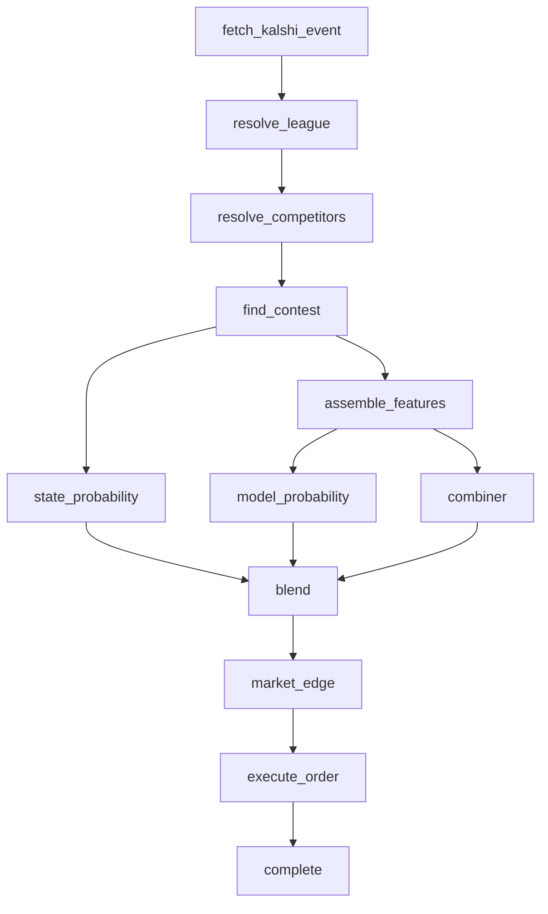

# Pipeline mermaid template

Every sport pipeline (an implementation of `SportPipeline` in
`src/pipeline/pipeline-contract.ts`) must document its stage graph with a
mermaid `flowchart TD` in its own file's doc comment, following this shape:

Node names map onto the `stage` values passed to `startStage`/`completeStage`/
`failStage` in `src/pipeline/stages.ts` (adapted to the pipeline's actual
stage names). Shared stages (`fetch_kalshi_event`, `calculate_market_edge`,
`execute_order`, `complete_prediction`) should keep those exact names since
they're implemented once and reused; per-sport stages should be named for
what they compute in that sport.

See `src/pipeline/head-to-head-clock-pipeline.ts` for the reference
implementation of this template for the two-team, clocked, head-to-head
shape (NFL, NCAAF, NBA, NCAAB, NHL, MLB).
