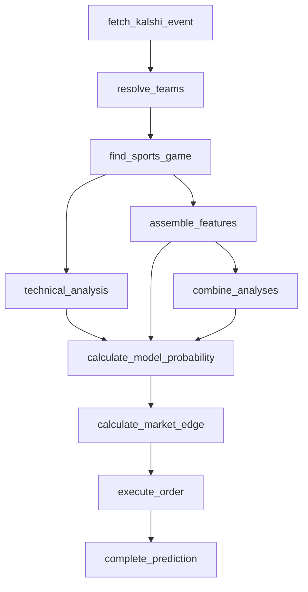

# Basketball pipeline (NBA, NCAAB)

NBA and NCAAB run on the shared `headToHeadClockPipeline`
(`src/pipeline/head-to-head-clock-pipeline.ts`) — the two-team, clocked,
head-to-head shape. Only the win-probability model coefficients differ
from the other leagues sharing that pipeline, and — unlike football —
from each other.

Identical to the graph documented on `headToHeadClockPipeline` — confirm
they match if either is edited.

## Model

- **Contest-state probability (`technical_analysis`):** the shared
  `computeTechnicalProbability` formula, unchanged. Basketball's high,
  additive scores make the score-differential-over-total-points ratio
  behave better here than in any other sport in this app — no saturation
  at typical NBA/NCAAB score levels the way it would in a low-scoring
  sport. The `technicalK` constant is tuned per league via the config UI
  (issue #159); the values seeded by the migration are defaults, not a
  claim of having been tuned against real games yet.
- **Win-probability model (`assemble_features`):** basketball-specific,
  `src/lib/basketball-win-probability-model.ts`. NBA
  (`NBA_MODEL_VERSION`, `1.0.0-nba-basketball`) and NCAAB
  (`NCAAB_MODEL_VERSION`, `1.0.0-ncaab-basketball`) get **separate**
  coefficient sets — `computeLeagueWinProbability` in
  `src/pipeline/assemble-features.ts` dispatches on the league key (not
  just the `"basketball"` family) via `getBasketballModelSpec`. No MLB
  coefficients are used for either.
- **Production stat:** `points` (already correct in the registry from
  issue #155's migration; carried over unchanged).
- **Backtests:**
  - NBA: `scripts/backtest-basketball-model.ts`, 1,231 completed 2024-25
    games, 64.8% in-sample accuracy.
  - NCAAB: `scripts/backtest-ncaab-model.ts`, 1,997 completed 2024-25
    games sampled from 120 of 360+ D1 teams (see the script's doc comment
    for why it samples rather than fetching every team), 67.1% in-sample
    accuracy.
  - The two fits produced meaningfully different intercepts/weights (NBA:
    0.2012 / 0.0884, NCAAB: 0.5839 / 0.0515) — not just a confidence
    difference — so NBA and NCAAB do **not** share a model, unlike
    NFL/NCAAF (`docs/pipelines/football.md`).
- **Standings:** already fixed for every league in issue #161
  (`getStandings` reads `/apis/v2/.../standings`, not the
  `/apis/site/v2/` stub).
