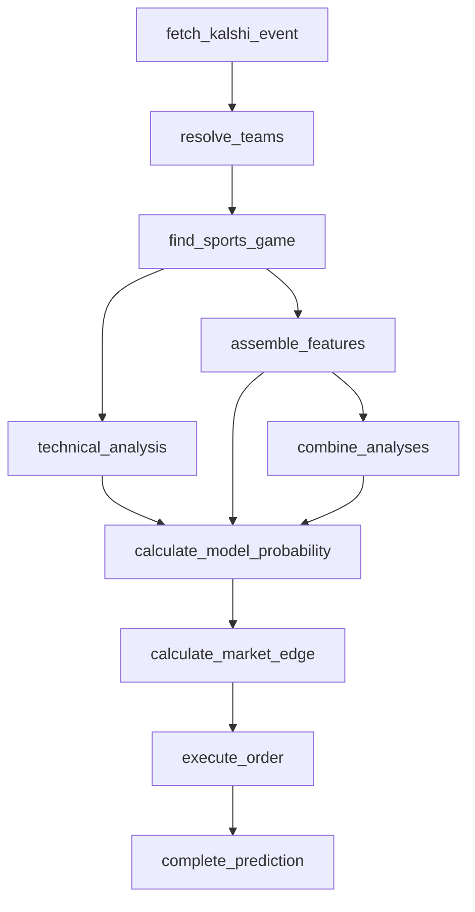

# Football pipeline (NFL, NCAAF)

NFL and NCAAF run on the shared `headToHeadClockPipeline`
(`src/pipeline/head-to-head-clock-pipeline.ts`) — the two-team, clocked,
head-to-head shape. Nothing football-specific lives in the orchestration;
only the win-probability model coefficients differ from the other leagues
sharing that pipeline.

This is identical to the graph documented on `headToHeadClockPipeline` —
confirm they match if either is edited.

## Model

- **Contest-state probability (`technical_analysis`):** the shared
  `computeTechnicalProbability` formula, unchanged — score differential
  over total points against game progress is defensible for football's
  scoring range, unlike low-scoring sports.
- **Win-probability model (`assemble_features`):** football-specific,
  `src/lib/football-win-probability-model.ts`, version
  `FOOTBALL_MODEL_VERSION` (`1.0.0-football`). No MLB coefficients are
  used — `computeLeagueWinProbability` in `src/pipeline/assemble-features.ts`
  dispatches on the league's `family` (`"football"`) to pick this model
  instead of the MLB one.
- **Production stat:** `yards` (`LEAGUE_REGISTRY.nfl.productionStatKey` /
  `.ncaaf.productionStatKey`), replacing the old shared `PRODUCTION_STAT_KEY`
  table entry.
- **Backtest:** `scripts/backtest-football-model.ts`, fit against 272
  completed 2025 NFL games — 62.1% in-sample accuracy. See the file doc
  comment on `football-win-probability-model.ts` for what's included
  (scoring-differential feature only) and what's deferred
  (`playerRatingDiff`, ships zero-weighted).
- **NFL vs. NCAAF:** share one model rather than separate coefficients.
  The backtest only has enough volume to fit against NFL; NCAAF's far
  larger team pool and wider strength spread mean the shared model will
  be less confident, not wrong-signed, for it. Revisit with a dedicated
  NCAAF backtest once volume justifies it.
- **Standings:** confirmed `/apis/site/v2/.../standings` returns an empty
  stub for football (`docs/espn-endpoint-audit.md`); `getStandings`
  (`src/lib/espn/queries.ts`) now reads `/apis/v2/.../standings` instead,
  via the client's new `getV2` method.
