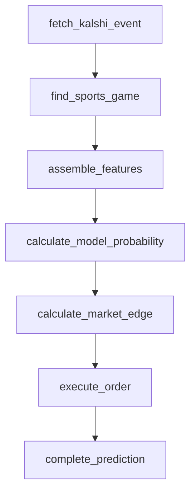

# Golf pipeline (PGA Tour) — field markets

The last league in the epic, and the only field market: a tournament has
~70-150 players, and the market asks which single one wins. This is the
only pipeline that pays the cost of true N-way support — every other
league in this app has exactly two competitors (or three, for soccer's
draw).

No `resolve_teams`/`resolve_athletes` node — there's nothing to resolve;
`GolfFieldProvider` already returns the whole field directly. No
`technical_analysis` or `combine_analyses` node either — see below.
`execute_order` and `complete_prediction` are reused unchanged.

## Field market support

- **Contest model:** `Contest.competitors: SportsCompetitor[]` already
  supported an arbitrary N (no change needed) — `GolfFieldProvider`
  (`src/lib/sports/golf-provider.ts`) returns every player in the field,
  not two.
- **Win probability per competitor, summing to 1:**
  `computeGolfFieldWinProbabilities`
  (`src/lib/golf-win-probability-model.ts`) is a softmax over every
  player's live strokes-behind-the-leader — sums to exactly 1 by
  construction, the same guarantee soccer's three-way model relies on.
- **Edge calculation, many legs, one settles yes:**
  `calculateFieldMarketEdgeStage`
  (`src/pipeline/golf/calculate-field-market-edge.ts`) evaluates every
  priced leg independently with the same `calculateMarketEdge` binary
  math every other pipeline uses (each leg — "this player wins outright"
  — is its own binary contract; nothing assumes the field's prices sum to
  1, and they don't: golf books overround heavily across ~100+ legs).
- **Position sizing across the field:** only ever bets the single
  best-edge leg — see that file's doc comment for why this is the
  correct scope boundary, not a shortcut: betting multiple legs of the
  same mutually-exclusive-outcome event simultaneously is a portfolio
  problem needing portfolio-level Kelly; restricting to one leg means
  `executeOrderStage`'s existing single-bet `calculatePositionSize`
  sizing is already correct, with no risk of over-committing bankroll
  across the field.
- **Settlement:** one leg settles yes, the rest settle no — already
  exactly how `checkSettlement` works for any market (it reads the
  specific traded market's own result), no golf-specific handling
  needed.

## Sport specifics

- **Scoreboard slug:** `pga` (named slug) confirmed working; only `pga`
  is registered — `lpga`/`liv`/`eur` are valid slugs per the issue but
  each would need its own volume/data confirmation, left for a future
  issue rather than guessed at.
- **Injuries:** confirmed 500. No availability feature set — matches the
  epic's known blockers.
- **Score direction:** honored via the registry's
  `scoreSemantics.higherWins: false` and by using `leaderScore -
  playerScore` (not the other way around) as the model's utility input —
  a lower stroke count always produces a higher win probability.
- **Progress:** rounds and holes, not a clock. `computeRoundProgress`
  (`GolfFieldProvider`) uses round completion (4 rounds) rather than the
  per-hole `playersummary` endpoint the issue names — a deliberate scope
  reduction (see the function's doc comment) since the model's only real
  feature is live strokes-behind-leader, not progress itself. One real
  bug found and fixed while building this: ESPN's per-round status
  reports `state: "post"`/`completed: true` once a single round finishes
  — using that to mean "the whole tournament is over" would mark a
  76%-unplayed tournament "final" after round 1. Fixed by reading the
  **event**-level status (tournament-wide) for the final/pre
  determination, and only the **competition**-level (round) status for
  the progress fraction.
- **`$ref` `.pvt` rewriting:** not encountered — this pipeline never
  follows a `$ref` link (it reads the scoreboard response directly), so
  there was nothing to rewrite. Documented in case a future golf feature
  addition needs the `playersummary` endpoint, which may return `.pvt`
  refs.

## Model

`src/lib/golf-win-probability-model.ts`, version `GOLF_MODEL_VERSION`
(`1.0.0-golf`) — fit and backtested (`scripts/backtest-golf-model.ts`)
against 2,250 (player, round-checkpoint) samples pooled from 6 completed
2025 PGA tournaments: 98.9% in-sample accuracy. That number is inflated
by class imbalance (most of a 70+ player field is hopelessly behind at
any checkpoint, so "predict not-the-winner" is trivially right for most
samples) — treat it as confirming the feature's sign and rough scale,
not as a precision claim; see the model file's doc comment.

World ranking, recent finishes, and course history (all named in the
issue scope) are **not** used: ESPN exposes no working world-ranking
endpoint for golf — `/rankings` 404s at both the sport and tour level,
confirmed live. Live strokes-behind-the-leader is the only real signal
this data source provides for golf.

## No contest-state phase, no combiner

Golf has no meaningful two-competitor "contest state" the shared ratio
formula (or hockey/soccer/tennis's difference formulas) could apply to —
there's no natural pairwise comparison across a 100+ player field.
Similarly, the LLM combiner phase takes exactly two competitors' scores;
adapting it to reason over the whole field isn't practical or
cost-effective. **Every golf config version is created with
`technicalWeight: 0` and `combinerWeight: 0`** — the same documented
zero-weight pattern used for MMA's contest-state phase and tennis's
combiner phase. The field win-probability model is the entire
prediction.
