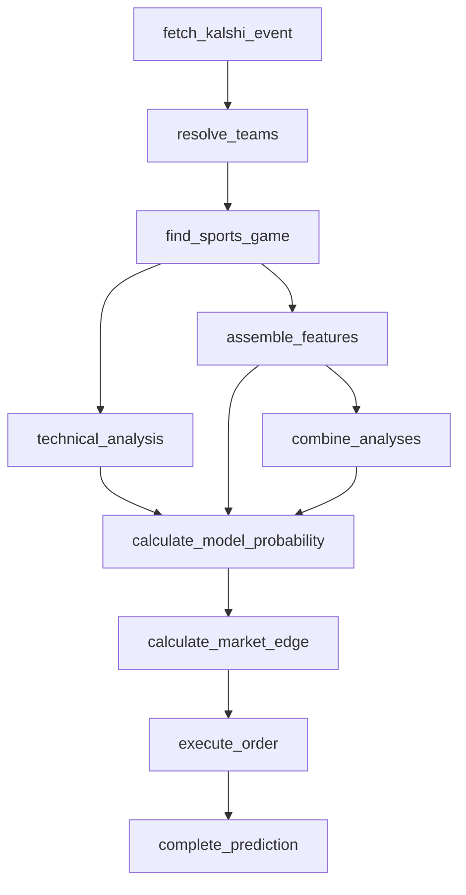

# Hockey pipeline (NHL)

NHL runs on the shared `headToHeadClockPipeline`
(`src/pipeline/head-to-head-clock-pipeline.ts`) — the two-team, clocked,
head-to-head shape. Hockey needed its own contest-state formula in
addition to its own win-probability model, since the shared score-ratio
formula breaks down at hockey's low scores.

Identical to the graph documented on `headToHeadClockPipeline` — confirm
they match if either is edited.

## Model

- **Contest-state probability (`technical_analysis`):** hockey-specific,
  `src/lib/hockey-technical-formula.ts`
  (`computeHockeyTechnicalProbability`, version
  `HOCKEY_TECHNICAL_ANALYSIS_VERSION` = `1.0.0-hockey`). The shared ratio
  formula `(T1-T2)/(T1+T2)` saturates at low scores — a 1-0 lead and a
  5-0 lead both give a ratio of exactly 1 — so hockey uses the raw goal
  difference times a time-remaining term (`S`, game progress) instead:
  `f(S) = 1 / (1 + e^(-k * S * (T1 - T2)))`. `computeLeagueTechnicalProbability`
  in `src/pipeline/technical-analysis.ts` dispatches on league family to
  pick this over the shared ratio formula.
- **Win-probability model (`assemble_features`):** hockey-specific,
  `src/lib/hockey-win-probability-model.ts`, version `HOCKEY_MODEL_VERSION`
  (`1.0.0-hockey`). No MLB coefficients are used.
- **Production stat:** `points` (already correct in the registry from
  issue #155; carried over unchanged).
- **Backtest:** `scripts/backtest-hockey-model.ts`, fit against 1,312
  completed 2024-25 NHL games — 56.7% in-sample accuracy. Lower than
  football's or basketball's, consistent with hockey being a
  higher-variance, lower-scoring sport.
- **Gamelog data:** the epic's known-blockers list (from the outdated
  `docs/espn_docs/`) claimed NHL athlete gamelog 404s. Both the issue
  #156 audit and a fresh live check (`GET .../athletes/{id}/gamelog`)
  returned 200 — the docs were stale. Player-strength features are not
  dropped for NHL; `assembleTeamFeatures`'s existing per-player
  `fetchStarterGamelogs` try/catch already degrades gracefully (empty
  gamelog entries) if a specific player's fetch ever fails, regardless of
  league, so no hockey-specific change was needed there.
- **Overtime/shootout:** ESPN's competitor `score` field already
  includes the shootout-deciding goal (confirmed against completed
  2024-25 games with a `Final/SO` status) — a 4-3 shootout win is
  reported as 4-3, not 3-3. The pipeline reads that score directly, so no
  special-casing is needed for the win-probability/technical-analysis
  phases. Settlement (`checkSettlement` /
  `src/pipeline/check-settlement.ts`) reads Kalshi's own authoritative
  `result` field regardless of how the game ended, so it already matches
  Kalshi's settlement without any hockey-specific code.
- **Standings:** already fixed for every league in issue #161
  (`getStandings` reads `/apis/v2/.../standings`, not the
  `/apis/site/v2/` stub).
