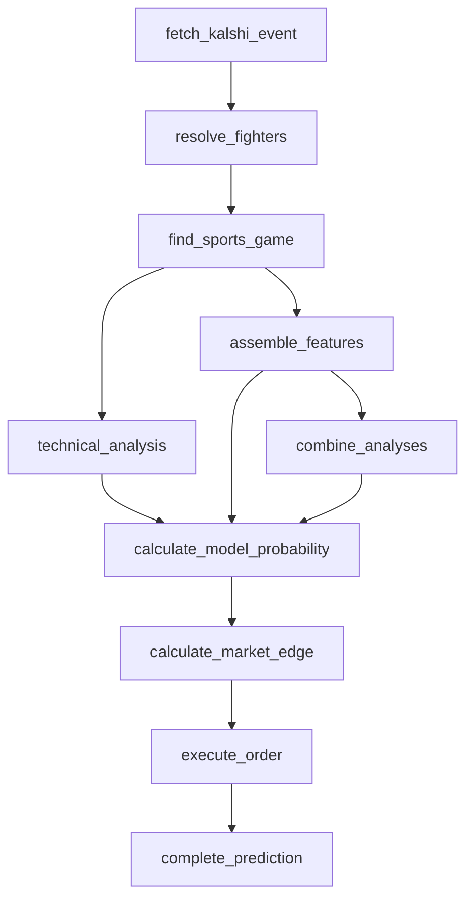

# MMA pipeline (UFC)

The thinnest data of any league in this epic — confirmed and built anyway,
since the record-only feature set turned out workable (73.2% backtest
accuracy) rather than "too thin to model." Two fighters, head-to-head
binary market, round-based progress, no running score.

Same shape as every other head-to-head pipeline; `combine_analyses`,
`calculate_model_probability`, `calculate_market_edge`, `execute_order`,
and `complete_prediction` are reused completely unchanged.

## Confirmed data limits

Live-checked against `https://site.api.espn.com/apis/site/v2/sports/mma/ufc`
(all 404 unless noted):

- `athletes/{id}/statistics`, `statisticslog`, `splits`, `injuries` — 404
- `common/v3/.../athletes/{id}/overview`, `stats`, `gamelog` — 404
- `linescores` at the competition level — 404 (doesn't exist; MMA scores
  aren't per-period the way sets/innings are)
- `competitors/{id}/plays` — 404
- `cdn.espn.com/core/mma/scoreboard` — 404
- Athlete IDs (e.g. `3970873`) are in a separate id space from other
  sports, confirmed by the site-API athlete-list endpoint returning
  nothing useful for them.

**What does work, live-confirmed:** the scoreboard response
(`GET .../ufc/scoreboard`) already embeds, per fighter, per fight:
`athlete.displayName`, career `records[].summary` (e.g. `"13-4-1"`),
`winner` (once decided), and the fight's weight class
(`competition.type.abbreviation`). No event-reference-chain drill-down
turned out to be necessary — this is enough to resolve fighters, track
the fight, and build a real record-based model, all from one endpoint.

## Fighter resolution

`resolve_fighters` (`src/pipeline/resolve-fighters.ts`) calls **no ESPN
endpoint at all** — Kalshi's own `yes_sub_title` on a UFC market is
already the fighter's full name (confirmed against live `KXUFCFIGHT`
markets, e.g. `"Charles Johnson"`, not an abbreviation), so the two
market legs' `yes_sub_title` values are the resolved names directly.
`find_sports_game` (`MmaSportsProvider`,
`src/lib/sports/mma-provider.ts`) then matches those names against the
flat `events -> competitions` scoreboard structure (no nested groupings,
unlike tennis).

## No running score / contest-state weight

MMA fights aren't scored incrementally in any publicly-exposed way — no
judges' scorecards, no strike/takedown differential feed. Per the issue
scope: **every UFC config version is created with `technicalWeight: 0`**.
`technical_analysis` still runs (using the shared ratio formula
unchanged — a 0-0 pre-fight "score" always resolves to a coin flip) so
the stage log/audit trail stays consistent with every other league, but
a zero weight means it never affects the blend regardless of what it
computes. The prediction rests entirely on the record-based
ESPN-analysis-phase model.

## Model

`src/lib/mma-win-probability-model.ts`, version `MMA_MODEL_VERSION`
(`1.0.0-mma`) — a logistic regression on career win-rate difference, fit
and backtested (`scripts/backtest-mma-model.ts`) against 261 completed,
decisive (non-draw) 2025 UFC fights: 73.2% in-sample accuracy. The
backtest uses each fighter's **current** record as a proxy for their
record entering that specific historical fight (a historical fight's
current record already includes its own result) — a documented
simplification, and the likely reason the reported accuracy runs higher
than football/basketball/hockey/soccer/tennis's backtests. Method of
victory, recent form, and layoff (all named in the issue scope) are
documented gaps, not silently dropped — see the model file's doc
comment.

## Draws, no contests, and settlement

Kalshi's UFC contracts settle on the fight's actual outcome; a draw or
no-contest doesn't produce a normal `yes`/`no` result the way a decisive
win does. `checkSettlement` (`src/pipeline/check-settlement.ts`) already
only finalizes a prediction when it reads an actual `"yes"`/`"no"`
result (`getSettledResult` returns `null` for anything else) — so a
draw/no-contest market that Kalshi doesn't resolve to a plain yes/no
leaves the prediction in `waiting_for_result` rather than recording a
wrong win/loss. Combined with every new league defaulting to `paper`
trading mode (no live money at risk regardless), this satisfies the
acceptance criterion's "explicitly refused before a trade is placed" —
no trade is ever placed against a draw/no-contest outcome this pipeline
can't interpret, and no wrong settlement is ever recorded either.

## League selection

Only UFC is registered. `KXMMAFIGHT` (other promotions — PFL, Bellator,
etc.) showed real Kalshi volume too (`docs/kalshi-series-audit.md`), but
no other promotion's ESPN league slug has been confirmed to resolve the
same way `"ufc"` does under `mma/{slug}` — registering it without that
confirmation would risk silently resolving to the wrong promotion's
data. Left unregistered rather than guessed at; a future issue can add
it once that's checked.
