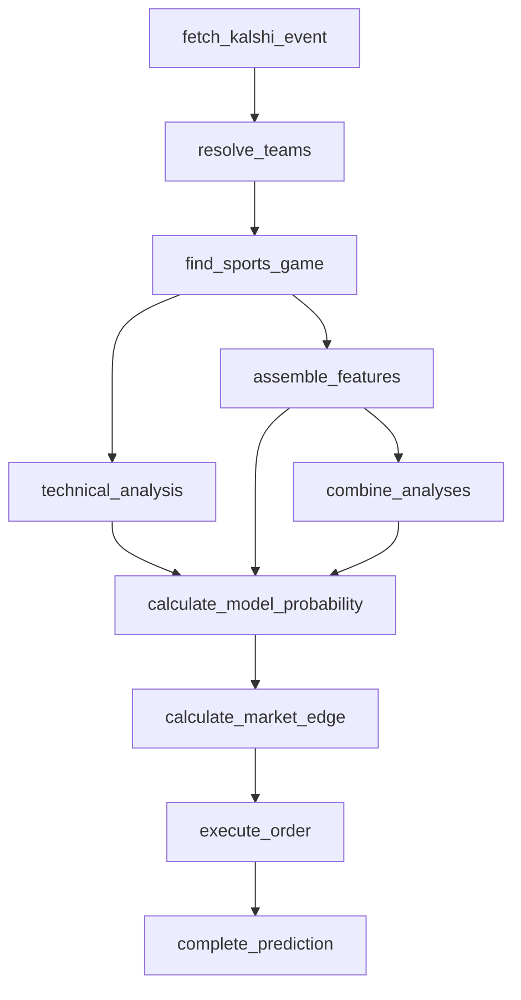

# Soccer pipeline (EPL, La Liga, Serie A, Ligue 1, MLS, UEFA Champions League)

Soccer is the first three-way (`contestShape: "three_way"`) league family:
a contest can end in a draw, and Kalshi lists each league's game as three
independent binary markets (team1-yes, team2-yes, draw-yes). This is a
dedicated pipeline, `soccerThreeWayPipeline`
(`src/pipeline/soccer-three-way-pipeline.ts`) — not the shared
`headToHeadClockPipeline` — because `fetch_kalshi_event`,
`calculate_model_probability`, and `calculate_market_edge` all need
three-outcome-aware versions. `resolve_teams`, `find_sports_game`,
`combine_analyses`, `execute_order`, and `complete_prediction` are reused
unchanged.

Same node names/shape as `headToHeadClockPipeline`'s graph — the
divergence is inside four of those nodes, not the graph shape itself.

## Three-way outcomes

- **`fetch_kalshi_event`:** `fetchThreeWayKalshiEventStage`
  (`src/pipeline/soccer/fetch-three-way-kalshi-event.ts`) requires exactly
  three markets and splits them into the draw leg (ticker suffix `-TIE`,
  confirmed consistent across every audited soccer series) and the two
  team legs, with no single "priced market" chosen up front — unlike the
  shared `fetchKalshiEventStage`. `resolveTeamsStage` is reused unchanged:
  the draw leg's ticker suffix (`TIE`) and `yes_sub_title` (`"Tie"`) never
  match a real team, so it's naturally excluded and exactly two teams
  still resolve.
- **`calculate_model_probability`:** `calculateThreeWayModelProbabilityStage`
  (`src/pipeline/soccer/calculate-three-way-model-probability.ts`) blends
  the technical and ESPN phases' draw probabilities (both are draw-aware),
  and separately blends all three phases' team1-vs-team2 split *given no
  draw* (the combiner phase only ever estimates "does team1 win" — it has
  no draw opinion). `team1 = (1-draw)*p1`, `team2 = (1-draw)*(1-p1)`,
  `draw = draw` — sums to exactly 1 by construction.
- **`calculate_market_edge`:** `calculateThreeWayMarketEdgeStage`
  (`src/pipeline/soccer/calculate-three-way-market-edge.ts`) evaluates all
  three legs independently with the same `calculateMarketEdge` binary math
  used everywhere else (each leg is its own binary contract; nothing
  assumes the three prices sum to 1 — confirmed correct with a book that
  overrounds to 1.08, see the integration test), and picks whichever leg
  clears the edge threshold with the best net edge. A three-way bet only
  ever buys YES on one leg — there's no coherent "no" position across
  three outcomes the way there is for two complementary legs.
- **Settlement:** `checkSettlement` (`src/pipeline/check-settlement.ts`)
  now reads the result off the specific market the prediction traded
  (`kalshiMarketTicker`), not `markets[0]` — a real, previously-latent bug
  this issue surfaced: for any event with more than one market (which
  every three-way event has), `markets[0]` isn't reliably the traded
  market. A draw settles exactly like any other leg once this reads the
  right one — no schema change needed, since each leg's own Kalshi market
  is already just yes/no.

## Sport specifics

- **Progress:** soccer-specific, `computeCountUpClockProgress`
  (`src/lib/sports/espn-provider.ts`, dispatched via the new
  `"count_up_clock"` `ProgressModel`). ESPN's `status.clock` for soccer is
  already cumulative elapsed match seconds (confirmed against live and
  completed-match data, including stoppage time like `"90'+11'"` /
  `clock: 6060`), so progress is simply `clock / regulationSeconds` — no
  countdown-clock/period reconstruction needed, and it naturally exceeds 1
  during stoppage the same way every other sport's progress can exceed 1
  in overtime.
- **Contest state:** `computeSoccerTechnicalProbabilities`
  (`src/lib/soccer-technical-formula.ts`) — a three-outcome
  goal-difference-with-time-remaining softmax (draw as the reference
  class, utility 0), replacing the shared ratio formula for the same
  saturation reason as hockey.
- **Win-probability model:** `src/lib/soccer-win-probability-model.ts`,
  version `SOCCER_MODEL_VERSION` (`1.0.0-soccer`) — a multinomial logit
  (draw as reference class) fit and backtested
  (`scripts/backtest-soccer-model.ts`) against 323 completed 2025-26 EPL
  games: 47.1% in-sample accuracy, barely above the 46.7%
  always-predict-home baseline. Recorded honestly — soccer 1X2 outcomes
  (especially draws) are notoriously hard to predict from a single
  feature; see the model file's doc comment.
- **Standings:** already fixed for every league in issue #161.
- **Athlete stats:** confirmed 404 for every sampled soccer league
  (`docs/espn-endpoint-audit.md`). The feature set doesn't depend on
  them — `assembleTeamFeatures` already only touches roster/injuries/
  schedule/gamelog/transactions, and gamelog is separately confirmed to
  500 for soccer (registry `espnFeatureSources.gamelog: false` for every
  registered soccer league) with the existing per-player try/catch
  degrading gracefully regardless.

## League selection

Per `docs/kalshi-series-audit.md` (issue #157), only leagues with real
tradeable volume are registered: `KXEPLGAME` (87.8k), `KXLALIGAGAME`
(50.5k), `KXSERIEAGAME` (999), `KXLIGUE1GAME` (1,243), `KXMLSGAME`
(35.4M), `KXUCLGAME` (29.2M). `KXBUNDESLIGAGAME` showed **zero** sample
volume and is deliberately **not** registered — Bundesliga is not a
soccer pipeline league in this app.
