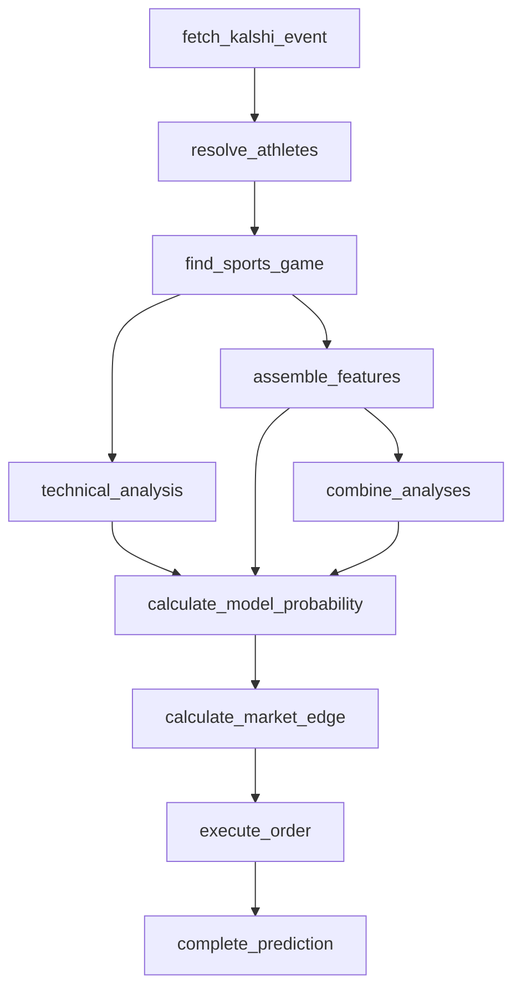

# Tennis pipeline (ATP, WTA)

The first athlete-competitor league family: two players, head-to-head
binary market, set-based (not clocked) progress, non-additive score
(a 2-1 sets lead isn't "ahead by one point" the way a football score
differential is). No team, roster, or injury endpoint exists for tennis,
so this pipeline is genuinely new rather than the shared
`headToHeadClockPipeline` with a formula swapped out.

Same node names/shape as `headToHeadClockPipeline` except `resolve_teams`
is `resolve_athletes` — `combine_analyses`, `calculate_model_probability`,
`calculate_market_edge`, `execute_order`, and `complete_prediction` are
reused completely unchanged; tennis is still a two-competitor,
single-probability, binary-market shape underneath, just resolved and
fed differently.

## Athlete competitors

- **No team directory equivalent.** `fetchTeamDirectory` has no tennis
  analogue — the `teams` endpoint returns tour sections, not
  competitors, and the full core-API athlete list is 18,000+ `$ref`-only
  entries across 3,600+ pages, useless for request-time name resolution.
  `fetchAthleteDirectory` (`src/lib/sports/athlete-directory.ts`) instead
  reuses the site API's **rankings** endpoint (top ~150 by name and id in
  one request) as both the resolution directory and the ranking feature
  source. A player ranked outside the top ~150 won't resolve — an
  accepted, documented limitation, not a silent wrong answer.
- **`resolve_athletes`** (`src/pipeline/resolve-athletes.ts`): athlete
  equivalent of `resolveTeamsStage`, matching each Kalshi market's
  `yes_sub_title` (full name) or ticker-suffix (abbreviated last name,
  e.g. `VAL` for Vallejo) against the rankings directory. Fails loudly —
  same as team resolution — on anything other than exactly two distinct
  resolved athletes.
- **`find_sports_game`:** `TennisSportsProvider`
  (`src/lib/sports/tennis-provider.ts`), not `EspnSportsProvider` — tennis's
  scoreboard nests one level deeper (`events -> groupings
  (singles/doubles) -> competitions`), and a competitor's score is sets
  won (from `linescores[].winner`), not a running points/goals tally.

## Sport specifics

- **Scoreboard slug:** `atp`/`wta` (named slugs) work; numeric tour IDs
  return 400 — confirmed, and the registry only ever uses the named
  slugs (`espnLeagueSegment`).
- **Injuries:** confirmed 500 (docs/espn-endpoint-audit.md and the
  original epic blockers list). No availability feature set exists for
  tennis — `espnFeatureSources` is all `false` in the registry, and
  `tennisAssembleFeaturesStage` never calls a team/roster/injury endpoint.
- **Progress:** set-based, not clocked — `computeSetsProgress`
  (`TennisSportsProvider`) divides sets played by the *statistical
  expectation* of sets in a match of this format (2.3 for best-of-3, 3.6
  for best-of-5 — not the maximum possible), so a straight-sets sweep
  still reads close to done rather than "only 67%". Best-of-5 is detected
  per match from ESPN's `event.major` flag (ATP majors only — WTA is
  always best-of-3, and this is checked with `league === "atp"` too).
- **Contest state:** `computeTennisTechnicalProbability`
  (`src/lib/tennis-technical-formula.ts`) — a set-difference model with a
  time-remaining term, same structure as hockey's and soccer's formulas
  for the same reason (sets won are low integers; the ratio formula would
  make a 1-0 and a 2-0 lead read identically).
- **Feature sources:** limited to rankings (confirmed against
  `docs/espn-endpoint-audit.md` and this issue's own live checks — no
  team/roster/injury/gamelog data exists for tennis). Recent form and
  head-to-head record (both named in the issue scope) are documented gaps
  in `src/lib/tennis-win-probability-model.ts`, not silently dropped:
  `recentFormDiff` ships zero-weighted, same convention as every other
  sport's not-yet-wired features.

## Model

`src/lib/tennis-win-probability-model.ts`, version `TENNIS_MODEL_VERSION`
(`1.0.0-tennis`) — a logistic regression on ranking difference, fit and
backtested (`scripts/backtest-tennis-model.ts`) against 181 completed
January 2025 ATP matches where both players were in the current top-150:
56.9% in-sample accuracy. The backtest uses **current** rankings as a
proxy for each match's pre-match ranking (ESPN exposes no historical
ranking snapshots) — a documented simplification, not an oversight.

## Combiner weight

Per the acceptance criterion's explicit either/or: tennis's raw payload
for the combiner is just two players' rankings — far thinner than any
team sport's schedule data. Rather than feed the LLM combiner a payload
too thin for it to add anything over the ranking model itself, every
tennis config version is created with **`combinerWeight: 0`**. The
combiner phase still runs and its output is recorded (for reference /
future re-evaluation), but it never affects the blended probability —
`calculateModelProbabilityStage`'s existing weighted-normalize-by-sum
blend already handles a zero weight correctly with no code change needed.
